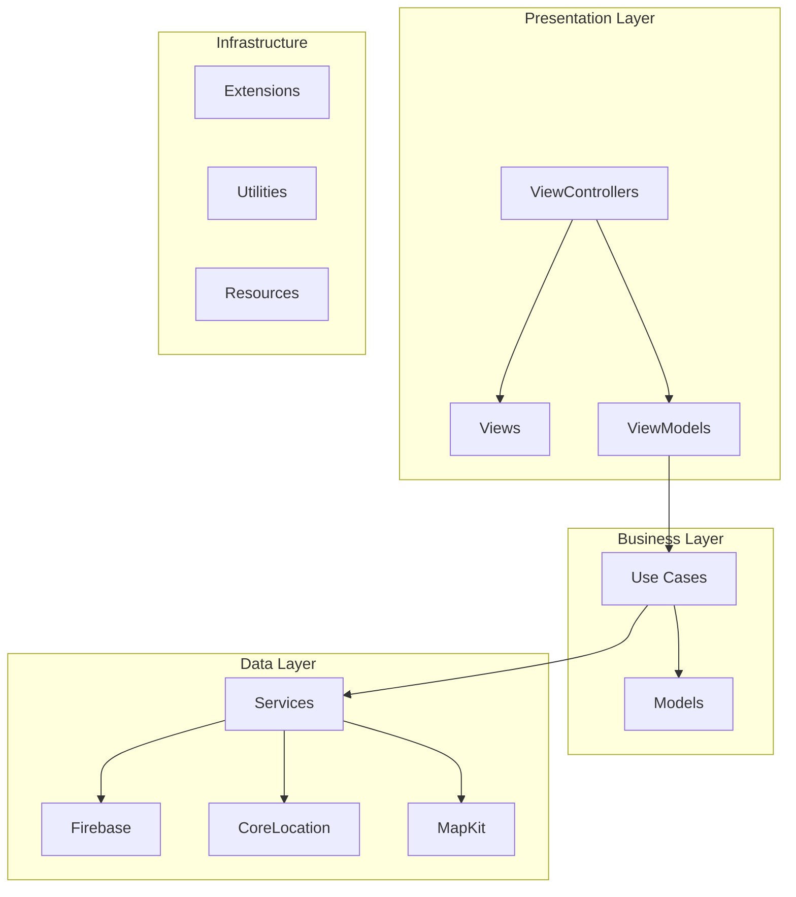

# 🏗️ Engenharia de Software - MeLevaAi

**Versão:** 1.0  
**Data:** Janeiro 2025  
**Desenvolvedor:** Jean Ramalho  
**Projeto:** Aplicativo iOS de Caronas Compartilhadas

---

## 📖 Sumário Executivo

Este documento apresenta a arquitetura de software, padrões de design e práticas de engenharia implementadas no MeLevaAi. O projeto segue princípios de Clean Architecture, implementando padrões MVVM com separação clara de responsabilidades, garantindo escalabilidade, manutenibilidade e testabilidade.

### Objetivos da Arquitetura
- Implementar arquitetura escalável e manutenível
- Garantir separação clara de responsabilidades
- Facilitar testes unitários e de integração
- Permitir evolução e extensão do sistema
- Manter código limpo e documentado

---

## 🏛️ Arquitetura Geral

### Padrão Arquitetural: MVVM + Clean Architecture



### Princípios Aplicados
- **Single Responsibility Principle**: Cada classe tem uma responsabilidade específica
- **Open/Closed Principle**: Aberto para extensão, fechado para modificação
- **Dependency Inversion**: Dependências abstraídas, não concretas
- **Interface Segregation**: Interfaces específicas e coesas
- **DRY (Don't Repeat Yourself)**: Evitar duplicação de código

---

## 📁 Estrutura de Camadas

### 1. 🎨 Presentation Layer (Apresentação)

#### ViewControllers
Responsáveis pela coordenação entre Views e ViewModels, gerenciando o ciclo de vida da interface.

```swift
// Exemplo: LoginViewController
class LoginViewController: UIViewController {
    private let contentView: LoginView = LoginView()
    private let authService = Authentication()
    
    // Coordenação entre View e ViewModel
    // Gerenciamento de ciclo de vida
    // Tratamento de eventos de UI
}
```

**Responsabilidades:**
- Coordenação de fluxos de navegação
- Gerenciamento de ciclo de vida
- Binding entre View e ViewModel
- Tratamento de eventos de UI

#### Views
Componentes de interface reutilizáveis implementados em ViewCode.

```swift
// Exemplo: LoginView
class LoginView: UIView {
    lazy var emailTextField: PaddedTextField = {
        let textField = PaddedTextField()
        // Configuração de UI
        return textField
    }()
    
    // Implementação de layout programático
    // Componentes reutilizáveis
    // Constraints e hierarquia
}
```

**Responsabilidades:**
- Definição de layout e componentes
- Implementação de constraints
- Componentes reutilizáveis
- Configuração visual

#### ViewModels
Camada de lógica de apresentação que conecta Views com Use Cases.

```swift
// Exemplo: RequestsViewModel
class RequestsViewModel: NSObject {
    private let requestService = Requests()
    private let auth = Authentication()
    
    // Lógica de negócio para apresentação
    // Estados reativos
    // Transformação de dados
}
```

**Responsabilidades:**
- Lógica de apresentação
- Estados reativos da UI
- Transformação de dados para exibição
- Comunicação com Use Cases

---

### 2. 🧠 Business Layer (Negócio)

#### Use Cases
Contêm a lógica de negócio específica da aplicação.

```swift
// Exemplo: RequestRideUseCase
class RequestRideUseCase {
    func execute(passenger: User, destination: CLLocationCoordinate2D) -> Result<RideRequest, Error> {
        // Validações de negócio
        // Regras específicas do domínio
        // Coordenação entre serviços
    }
}
```

**Responsabilidades:**
- Regras de negócio específicas
- Validações de domínio
- Coordenação entre serviços
- Casos de uso da aplicação

#### Models
Entidades de domínio que representam conceitos do negócio.

```swift
// Exemplo: UserRequestModel
struct UserRequestModel {
    var email: String
    var nome: String
    var coordinate: CLLocationCoordinate2D?
    var destinyCoordinate: CLLocationCoordinate2D?
    var status: String
    
    // Lógica de domínio
    // Validações específicas
    // Transformações de dados
}
```

**Responsabilidades:**
- Representação de entidades de domínio
- Validações de negócio
- Lógica específica do domínio
- Transformações de dados

---

### 3. 💾 Data Layer (Dados)

#### Services
Camada de acesso a dados e serviços externos.

```swift
// Exemplo: Authentication
class Authentication {
    let auth = Auth.auth()
    let database = Database.database().reference()
    
    // Comunicação com Firebase
    // Tratamento de erros de rede
    // Transformação de dados externos
}
```

**Responsabilidades:**
- Acesso a dados externos
- Comunicação com APIs
- Tratamento de erros de rede
- Transformação de dados externos

#### Repositories (Implícito)
Padrão implementado através dos Services para abstração de acesso a dados.

```swift
// Exemplo: UserRepository (implícito em Authentication)
protocol UserRepository {
    func createUser(_ user: User) -> Result<User, Error>
    func getUser(by id: String) -> Result<User, Error>
    func updateUser(_ user: User) -> Result<User, Error>
}
```

---

## 🔧 Padrões de Design Implementados

### 1. 🏭 Factory Pattern
Criação de objetos complexos de forma centralizada.

```swift
// Exemplo: ViewController Factory
class ViewControllerFactory {
    static func createLoginViewController() -> LoginViewController {
        return LoginViewController()
    }
    
    static func createDriverViewController() -> DriverViewController {
        return DriverViewController()
    }
}
```

### 2. 👁️ Observer Pattern
Comunicação desacoplada entre componentes.

```swift
// Exemplo: Location Updates
class LocationViewModel {
    var onLocationUpdate: ((CLLocationCoordinate2D) -> Void)?
    
    func notifyLocationUpdate(_ coordinate: CLLocationCoordinate2D) {
        onLocationUpdate?(coordinate)
    }
}
```

### 3. 🎯 Strategy Pattern
Algoritmos intercambiáveis para diferentes comportamentos.

```swift
// Exemplo: Authentication Strategies
protocol AuthenticationStrategy {
    func authenticate(credentials: Credentials) -> Result<User, Error>
}

class FirebaseAuthStrategy: AuthenticationStrategy {
    func authenticate(credentials: Credentials) -> Result<User, Error> {
        // Implementação específica do Firebase
    }
}
```

### 4. 🏗️ Builder Pattern
Construção de objetos complexos passo a passo.

```swift
// Exemplo: Alert Builder
class AlertBuilder {
    private var title: String = ""
    private var message: String = ""
    private var actions: [UIAlertAction] = []
    
    func setTitle(_ title: String) -> AlertBuilder {
        self.title = title
        return self
    }
    
    func setMessage(_ message: String) -> AlertBuilder {
        self.message = message
        return self
    }
    
    func build() -> UIAlertController {
        let alert = UIAlertController(title: title, message: message, preferredStyle: .alert)
        actions.forEach { alert.addAction($0) }
        return alert
    }
}
```

---

## 🧪 Testes e Qualidade

### Estratégia de Testes

#### 1. Testes Unitários
Testes isolados de componentes individuais.

```swift
// Exemplo: RequestViewModel Tests
class RequestViewModelTests: XCTestCase {
    var viewModel: RequestsViewModel!
    var mockAuthService: MockAuthentication!
    
    override func setUp() {
        super.setUp()
        mockAuthService = MockAuthentication()
        viewModel = RequestsViewModel(authService: mockAuthService)
    }
    
    func testRequestCarWithValidData() {
        // Given
        let validLocation = CLLocationCoordinate2D(latitude: -23.5505, longitude: -46.6333)
        
        // When
        viewModel.requestACar { success in
            // Then
            XCTAssertTrue(success)
        }
    }
}
```

#### 2. Testes de Integração
Testes de componentes trabalhando juntos.

```swift
// Exemplo: Authentication Integration Tests
class AuthenticationIntegrationTests: XCTestCase {
    func testCompleteLoginFlow() {
        // Testa fluxo completo de login
        // Validação de dados
        // Comunicação com Firebase
    }
}
```

#### 3. Testes de UI
Testes automatizados da interface do usuário.

```swift
// Exemplo: UI Tests
class LoginUITests: XCTestCase {
    func testLoginWithValidCredentials() {
        let app = XCUIApplication()
        app.launch()
        
        app.textFields["emailTextField"].tap()
        app.textFields["emailTextField"].typeText("test@email.com")
        
        app.secureTextFields["passwordTextField"].tap()
        app.secureTextFields["passwordTextField"].typeText("password123")
        
        app.buttons["loginButton"].tap()
        
        XCTAssertTrue(app.navigationBars["MeLevaAí - Motorista"].exists)
    }
}
```

### Métricas de Qualidade

#### Code Coverage
- **Meta**: > 80% de cobertura de código
- **Ferramenta**: Xcode Code Coverage
- **Foco**: Lógica de negócio e ViewModels

#### Code Quality
- **Linting**: SwiftLint para padrões de código
- **Complexity**: Ciclomática < 10 por método
- **Duplication**: < 5% de código duplicado

---

## 🔄 Gerenciamento de Estado

### Estado da Aplicação

#### 1. Estado Local (ViewModels)
```swift
class RequestsViewModel {
    private(set) var requestsList: [UserRequestModel] = []
    private(set) var isCarCalled: Bool = false
    private(set) var currentRequestId: String?
    
    // Estados reativos
    // Notificações de mudança
    // Sincronização com UI
}
```

#### 2. Estado Global (Singleton quando necessário)
```swift
class AppStateManager {
    static let shared = AppStateManager()
    private init() {}
    
    var currentUser: User?
    var isUserLoggedIn: Bool = false
    var userType: UserType = .passenger
    
    // Estado global da aplicação
    // Persistência entre telas
    // Sincronização de dados
}
```

#### 3. Estado Persistente (Firebase)
```swift
// Estado sincronizado com Firebase
// Dados compartilhados entre usuários
// Backup automático
```

---

## 🚀 Performance e Otimização

### Estratégias de Performance

#### 1. Lazy Loading
```swift
lazy var requestsTableView: UITableView = {
    let tableView = UITableView()
    tableView.translatesAutoresizingMaskIntoConstraints = false
    return tableView
}()
```

#### 2. Memory Management
```swift
// Weak references para evitar retain cycles
weak var delegate: SomeDelegate?

// Proper cleanup em deinit
deinit {
    removeKeyboardObservers()
    locationManager.stopUpdatingLocation()
}
```

#### 3. Background Processing
```swift
// Operações pesadas em background
DispatchQueue.global(qos: .userInitiated).async {
    // Processamento pesado
    DispatchQueue.main.async {
        // Atualização da UI
    }
}
```

#### 4. Caching Strategy
```swift
// Cache de dados frequentemente acessados
private var locationCache: [String: CLLocationCoordinate2D] = [:]

func getCachedLocation(for key: String) -> CLLocationCoordinate2D? {
    return locationCache[key]
}
```

---

## 🔒 Segurança e Validação

### Validação de Dados

#### 1. Input Validation
```swift
func validateEmail(_ email: String) -> Bool {
    let emailRegex = "[A-Z0-9a-z._%+-]+@[A-Za-z0-9.-]+\\.[A-Za-z]{2,64}"
    let emailPredicate = NSPredicate(format:"SELF MATCHES %@", emailRegex)
    return emailPredicate.evaluate(with: email)
}
```

#### 2. Data Sanitization
```swift
func sanitizeInput(_ input: String) -> String {
    return input.trimmingCharacters(in: .whitespacesAndNewlines)
                .replacingOccurrences(of: "<", with: "&lt;")
                .replacingOccurrences(of: ">", with: "&gt;")
}
```

#### 3. Error Handling
```swift
enum AppError: Error {
    case networkError(Error)
    case validationError(String)
    case authenticationError(AuthError)
    
    var localizedDescription: String {
        switch self {
        case .networkError(let error):
            return "Erro de rede: \(error.localizedDescription)"
        case .validationError(let message):
            return "Erro de validação: \(message)"
        case .authenticationError(let authError):
            return authError.localizedDescription
        }
    }
}
```

---

## 📊 Monitoramento e Logging

### Sistema de Logging

#### 1. Structured Logging
```swift
enum LogLevel {
    case debug, info, warning, error
}

class Logger {
    static func log(_ level: LogLevel, _ message: String, file: String = #file, function: String = #function, line: Int = #line) {
        let timestamp = DateFormatter.logFormatter.string(from: Date())
        let fileName = URL(fileURLWithPath: file).lastPathComponent
        print("[\(timestamp)] [\(level)] [\(fileName):\(line)] \(function): \(message)")
    }
}
```

#### 2. Performance Monitoring
```swift
class PerformanceMonitor {
    static func measureTime<T>(_ operation: () throws -> T) rethrows -> (result: T, duration: TimeInterval) {
        let startTime = CFAbsoluteTimeGetCurrent()
        let result = try operation()
        let duration = CFAbsoluteTimeGetCurrent() - startTime
        
        Logger.log(.info, "Operation completed in \(duration) seconds")
        return (result, duration)
    }
}
```

---

## 🔄 CI/CD e Deploy

### Pipeline de Integração Contínua

#### 1. Build Automation
```yaml
# GitHub Actions Workflow
name: iOS Build
on: [push, pull_request]

jobs:
  build:
    runs-on: macos-latest
    steps:
    - uses: actions/checkout@v2
    - name: Setup Xcode
      uses: maxim-lobanov/setup-xcode@v1
      with:
        xcode-version: latest-stable
    - name: Build
      run: xcodebuild -project MeLevaAi.xcodeproj -scheme MeLevaAi -destination 'platform=iOS Simulator,name=iPhone 14' build
    - name: Test
      run: xcodebuild -project MeLevaAi.xcodeproj -scheme MeLevaAi -destination 'platform=iOS Simulator,name=iPhone 14' test
```

#### 2. Code Quality Gates
- **Build Success**: Compilação sem erros
- **Tests Pass**: Todos os testes passando
- **Code Coverage**: > 80% de cobertura
- **Linting**: SwiftLint sem violações críticas

---

## 📈 Métricas e KPIs

### Métricas Técnicas

#### 1. Performance
- **App Launch Time**: < 2 segundos
- **Screen Transition**: < 300ms
- **API Response Time**: < 1 segundo
- **Memory Usage**: < 100MB em uso normal

#### 2. Qualidade
- **Bug Rate**: < 1 bug por 1000 linhas de código
- **Code Coverage**: > 80%
- **Technical Debt**: < 10% do tempo de desenvolvimento
- **Build Success Rate**: > 95%

#### 3. Produtividade
- **Deployment Frequency**: Diário
- **Lead Time**: < 1 dia para features simples
- **Mean Time to Recovery**: < 1 hora
- **Change Failure Rate**: < 5%

---

## 🔮 Evolução e Roadmap

### Melhorias Planejadas

#### 1. Arquitetura
- **Modularização**: Separação em módulos independentes
- **Dependency Injection**: Container de dependências
- **Reactive Programming**: RxSwift ou Combine
- **Clean Architecture**: Implementação completa

#### 2. Qualidade
- **Testes Automatizados**: Cobertura completa
- **Code Review**: Processo formalizado
- **Documentação**: API documentation automática
- **Monitoring**: Métricas em tempo real

#### 3. Performance
- **Caching**: Estratégia avançada de cache
- **Lazy Loading**: Carregamento sob demanda
- **Image Optimization**: Compressão e cache de imagens
- **Network Optimization**: Request batching e compression

---

## 📚 Referências e Padrões

### Arquitetura
- **Clean Architecture** - Robert C. Martin
- **MVVM Pattern** - Microsoft Patterns & Practices
- **SOLID Principles** - Robert C. Martin
- **iOS Architecture Patterns** - Apple Developer Documentation

### Design Patterns
- **Gang of Four** - Design Patterns
- **iOS Design Patterns** - Apple Developer Documentation
- **Swift Design Patterns** - Ray Wenderlich

### Ferramentas e Frameworks
- **Firebase** - Google Cloud Platform
- **MapKit** - Apple Framework
- **CoreLocation** - Apple Framework
- **SwiftLint** - Code Style Enforcement

---

## 📋 Checklist de Implementação

### ✅ Arquitetura Implementada
- [x] Padrão MVVM
- [x] Separação de camadas
- [x] ViewCode para layouts
- [x] Extensions para reutilização
- [x] Error handling robusto
- [x] Memory management adequado

### 🔄 Em Desenvolvimento
- [ ] Testes unitários completos
- [ ] Dependency injection
- [ ] Reactive programming
- [ ] Modularização

### 📅 Próximas Etapas
- [ ] CI/CD pipeline
- [ ] Performance monitoring
- [ ] Code quality gates
- [ ] Documentation automation

---

**Documento elaborado por:** Jean Ramalho  
**Data de criação:** Janeiro 2025  
**Próxima revisão:** Conforme evolução da arquitetura
