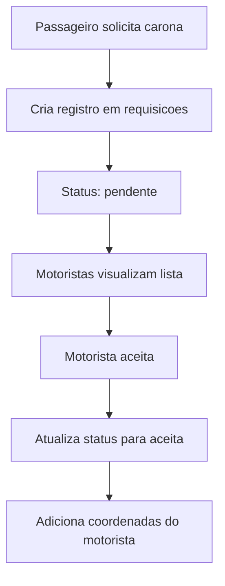
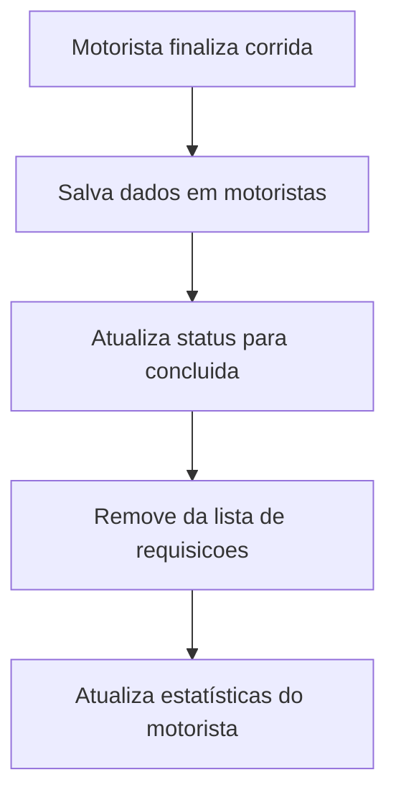

# 🗄️ Personas de Banco de Dados - MeLevaAi

**Versão:** 1.0  
**Data:** Janeiro 2025  
**Desenvolvedor:** Jean Ramalho  
**Projeto:** Aplicativo iOS de Caronas Compartilhadas

---

## 📖 Sumário Executivo

Este documento apresenta a modelagem de dados e personas do banco de dados do MeLevaAi, um aplicativo de caronas compartilhadas. O sistema utiliza Firebase Realtime Database como backend, implementando uma estrutura hierárquica otimizada para operações em tempo real e escalabilidade.

### Objetivos da Modelagem
- Definir estrutura de dados eficiente para operações em tempo real
- Garantir escalabilidade para crescimento de usuários
- Otimizar consultas e sincronização de dados
- Implementar segurança e integridade dos dados

---

## 🏗️ Arquitetura do Banco de Dados

### Tecnologia Utilizada
- **Firebase Realtime Database**
- **Estrutura Hierárquica JSON**
- **Sincronização em Tempo Real**
- **Regras de Segurança Configuráveis**

### Princípios de Design
- **Denormalização Controlada**: Dados duplicados para performance
- **Hierarquia Lógica**: Organização por entidades principais
- **Chaves Semânticas**: IDs descritivos quando possível
- **Timestamps Automáticos**: Controle temporal de dados

---

## 👥 Personas de Dados

### 1. 👤 Usuários (usuarios)

**Descrição:** Entidade central que armazena informações básicas de todos os usuários do sistema.

```json
{
  "usuarios": {
    "userId": {
      "nome": "João Silva",
      "email": "joao.silva@email.com",
      "motorista": true,
      "dataCadastro": "2025-01-15T10:30:00Z",
      "ultimaAtualizacao": "2025-01-15T10:30:00Z"
    }
  }
}
```

**Campos:**
- `nome` (String): Nome completo do usuário
- `email` (String): Email único para autenticação
- `motorista` (Boolean): Flag que define o tipo de usuário
- `dataCadastro` (Timestamp): Data de criação da conta
- `ultimaAtualizacao` (Timestamp): Última modificação do perfil

**Relacionamentos:**
- 1:N com `requisicoes` (via email)
- 1:N com `motoristas.corridasConcluidas` (se motorista)

**Operações Principais:**
- CREATE: Durante cadastro de usuário
- READ: Verificação de perfil e autenticação
- UPDATE: Atualização de dados pessoais
- DELETE: Remoção de conta (soft delete recomendado)

---

### 2. 🚗 Requisições (requisicoes)

**Descrição:** Entidade que gerencia todas as solicitações de caronas, desde criação até conclusão.

```json
{
  "requisicoes": {
    "requestId": {
      "email": "maria.passageiro@email.com",
      "nome": "Maria Santos",
      "latitude": "-23.5505",
      "longitude": "-46.6333",
      "destinyLatitude": "-23.5615",
      "destinyLongitude": "-46.6565",
      "status": "pendente",
      "motoristaLatitude": null,
      "motoristaLongitude": null,
      "dataCriacao": "2025-01-15T14:20:00Z",
      "ultimaAtualizacao": "2025-01-15T14:20:00Z"
    }
  }
}
```

**Campos:**
- `email` (String): Email do passageiro solicitante
- `nome` (String): Nome do passageiro
- `latitude/longitude` (String): Coordenadas de origem
- `destinyLatitude/destinyLongitude` (String): Coordenadas de destino
- `status` (String): Estado atual da corrida
- `motoristaLatitude/motoristaLongitude` (Number): Posição do motorista (quando aceita)
- `dataCriacao` (Timestamp): Momento da solicitação
- `ultimaAtualizacao` (Timestamp): Última modificação

**Estados Possíveis:**
- `pendente`: Aguardando aceitação
- `aceita`: Motorista a caminho
- `em_andamento`: Corrida em progresso
- `concluida`: Finalizada

**Operações Principais:**
- CREATE: Nova solicitação de carona
- READ: Listagem para motoristas
- UPDATE: Mudanças de status e localização
- DELETE: Cancelamento ou conclusão

---

### 3. 🏆 Motoristas (motoristas)

**Descrição:** Entidade especializada para armazenar histórico e dados específicos de motoristas.

```json
{
  "motoristas": {
    "joao_silva_email_com": {
      "corridasConcluidas": {
        "rideId1": {
          "passageiroNome": "Maria Santos",
          "passageiroEmail": "maria.santos@email.com",
          "origemLatitude": "-23.5505",
          "origemLongitude": "-46.6333",
          "destinoLatitude": "-23.5615",
          "destinoLongitude": "-46.6565",
          "motoristaNome": "João Silva",
          "motoristaEmail": "joao.silva@email.com",
          "status": "concluida",
          "concluidaEm": "2025-01-15T16:45:00Z",
          "rideId": "rideId1"
        }
      },
      "estatisticas": {
        "totalCorridas": 15,
        "avaliacaoMedia": 4.8,
        "ultimaAtividade": "2025-01-15T16:45:00Z"
      }
    }
  }
}
```

**Campos:**
- `corridasConcluidas` (Object): Histórico de corridas
- `estatisticas` (Object): Métricas do motorista
- `totalCorridas` (Number): Contador de corridas
- `avaliacaoMedia` (Number): Média de avaliações
- `ultimaAtividade` (Timestamp): Última corrida

**Operações Principais:**
- CREATE: Primeira corrida do motorista
- READ: Histórico e estatísticas
- UPDATE: Adição de novas corridas
- DELETE: Raramente utilizado

---

## 🔄 Fluxos de Dados

### Fluxo 1: Solicitação de Carona


### Fluxo 2: Conclusão de Corrida


---

## 🔍 Consultas e Operações

### Consultas Frequentes

#### 1. Buscar Requisições Pendentes
```javascript
// Firebase Query
database.ref('requisicoes')
  .orderByChild('status')
  .equalTo('pendente')
  .on('value', callback);
```

#### 2. Buscar Requisições por Passageiro
```javascript
// Firebase Query
database.ref('requisicoes')
  .orderByChild('email')
  .equalTo('passageiro@email.com')
  .on('value', callback);
```

#### 3. Histórico de Corridas do Motorista
```javascript
// Firebase Query
database.ref('motoristas')
  .child('motorista_email_com')
  .child('corridasConcluidas')
  .orderByChild('concluidaEm')
  .limitToLast(10)
  .on('value', callback);
```

### Operações de Escrita

#### 1. Criar Nova Requisição
```javascript
const newRequest = {
  email: userEmail,
  nome: userName,
  latitude: currentLatitude,
  longitude: currentLongitude,
  destinyLatitude: destinationLatitude,
  destinyLongitude: destinationLongitude,
  status: 'pendente',
  dataCriacao: ServerValue.timestamp()
};

database.ref('requisicoes').push(newRequest);
```

#### 2. Atualizar Status da Corrida
```javascript
const updates = {
  status: 'aceita',
  motoristaLatitude: driverLatitude,
  motoristaLongitude: driverLongitude,
  ultimaAtualizacao: ServerValue.timestamp()
};

database.ref('requisicoes').child(requestId).update(updates);
```

---

## 📊 Otimizações de Performance

### 1. Estrutura Hierárquica
- **Vantagem**: Consultas mais rápidas por proximidade
- **Implementação**: Dados organizados por entidade principal
- **Exemplo**: `requisicoes/requestId` vs `requisicoes/status/pendente/requestId`

### 2. Denormalização Controlada
- **Vantagem**: Reduz número de consultas
- **Implementação**: Dados duplicados quando necessário
- **Exemplo**: Nome do passageiro em `requisicoes` e `motoristas.corridasConcluidas`

### 3. Índices Estratégicos
- **Campo**: `status` em `requisicoes`
- **Campo**: `email` em `requisicoes`
- **Campo**: `concluidaEm` em `motoristas.corridasConcluidas`

### 4. Paginação de Dados
- **Implementação**: `limitToLast()` para histórico
- **Benefício**: Reduz transferência de dados
- **Uso**: Listagem de corridas concluídas

---

## 🔒 Segurança e Regras

### Regras de Segurança Firebase

```javascript
{
  "rules": {
    "usuarios": {
      "$uid": {
        ".read": "auth != null && auth.uid == $uid",
        ".write": "auth != null && auth.uid == $uid"
      }
    },
    "requisicoes": {
      ".read": "auth != null",
      ".write": "auth != null",
      "$requestId": {
        ".validate": "newData.hasChildren(['email', 'nome', 'status'])"
      }
    },
    "motoristas": {
      ".read": "auth != null",
      ".write": "auth != null"
    }
  }
}
```

### Validações de Dados
- **Email**: Formato válido obrigatório
- **Coordenadas**: Valores numéricos válidos
- **Status**: Valores pré-definidos apenas
- **Timestamps**: Valores automáticos do servidor

---

## 📈 Métricas e Monitoramento

### KPIs do Banco de Dados
- **Número de Requisições**: Contagem de solicitações por período
- **Taxa de Aceitação**: Percentual de corridas aceitas
- **Tempo Médio de Resposta**: Performance das consultas
- **Uso de Armazenamento**: Crescimento do banco de dados

### Alertas Configurados
- **Alto Volume de Requisições**: > 100/minuto
- **Erro de Conexão**: Falhas de sincronização
- **Uso de Quota**: Aproximação dos limites do Firebase
- **Consultas Lentas**: Tempo de resposta > 2 segundos

---

## 🔮 Evolução e Melhorias Futuras

### Melhorias Planejadas
1. **Sistema de Avaliações**: Nova entidade para ratings
2. **Chat em Tempo Real**: Mensagens entre usuários
3. **Notificações Push**: Sistema de alertas
4. **Analytics Avançados**: Métricas detalhadas de uso
5. **Backup Automático**: Sincronização com Cloud Storage

### Considerações de Escalabilidade
- **Sharding**: Divisão por região geográfica
- **Cache**: Implementação de Redis para consultas frequentes
- **CDN**: Distribuição de dados estáticos
- **Microserviços**: Separação de responsabilidades

---

## 📋 Checklist de Implementação

### ✅ Funcionalidades Implementadas
- [x] Estrutura básica de usuários
- [x] Sistema de requisições completo
- [x] Histórico de motoristas
- [x] Validações de dados
- [x] Regras de segurança
- [x] Consultas otimizadas
- [x] Sincronização em tempo real

### 🔄 Em Desenvolvimento
- [ ] Sistema de avaliações
- [ ] Métricas avançadas
- [ ] Backup automatizado
- [ ] Monitoramento de performance

### 📅 Próximas Etapas
- [ ] Implementação de cache
- [ ] Otimização de consultas
- [ ] Testes de carga
- [ ] Documentação de APIs

---

## 📚 Referências e Documentação

### Documentação Técnica
- [Firebase Realtime Database Documentation](https://firebase.google.com/docs/database)
- [Firebase Security Rules](https://firebase.google.com/docs/database/security)
- [Firebase Performance Monitoring](https://firebase.google.com/docs/perf-mon)

### Padrões Utilizados
- **RESTful API**: Princípios de design de APIs
- **ACID Properties**: Consistência de dados
- **CAP Theorem**: Balanceamento de consistência e disponibilidade
- **Event Sourcing**: Rastreamento de mudanças de estado

---

**Documento elaborado por:** Jean Ramalho  
**Data de criação:** Janeiro 2025  
**Próxima revisão:** Conforme evolução do projeto
